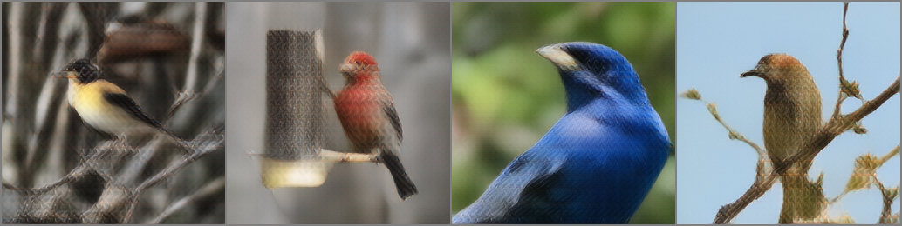

# VQGAN

Vector Quantized Generative Adversarial Network (VGGAN) achieves a performant fusion architecture of CNN and Transformer, now become an prevalent backbone network.
In this work, Let's inspect the details of VQGAN and get some insights to reproduce Unicolor.

## Fast links

- [Reproduce Memo](#reproduce-memo)
- [Reconstruction](#reconstruction)
- [Training VQGAN](#training-vqgan)
- [Issues](#issues)

## Reproduce Memo
<a id="reproduce-memo"></a>

- Reproduce 1st stage Chroma-VQGAN trying to implant our custom setting as intact as possible.
  - Reproduce training codes <span style="color:red">(WIP)</span>
    - Merge VQModel with GumbelVQ <span style="color:green">(Done)</span>
    - Test merged VQModel with GumbelVQ <span style="color:red">(WIP)</span>
    - Understand about pytorch lightning
      - Investigate 'Trainer'
- Investigate Gumbel Softmax 
  - Write doc4 each arguments of gumbel


<figure>

<figcaption align = "center"><b>Fig.1 VGGAN</b></figcaption>
</figure>

<figure>

<figcaption align = "center"><b>Fig.2 UniColor</b></figcaption>
</figure>

## Idea Memo
- random grascale transfer? usint 1x1 convolution

## Reconstruction
<a id="reconstruction"></a>

The author provides an [example code](https://colab.research.google.com/github/CompVis/taming-transformers/blob/master/scripts/reconstruction_usage.ipynb#scrollTo=3RxdhDGtyJ4q) to enable checking the reconstruction quality. 
I move and refine the example code into a file, recon.py. 
The example uses three types of variants `VQGAN(f8,8192)`, `VGGAN(f16, 16384)`, `VQGAN(f16, 1024)`.
The notation `f{N}` means the spatial resolution of feature as K/N by K/N w.r.t. the input image size of K by K, that is `f8` and `f16` means 32 by 32 and 16 by 16 spatial resolution from 256 by 256 imput image.
The second number refers to the number of codebook entries.
Although not described, the dimensionality of codebook entries are generally 256.
A result example is as
 
As shown the figure, the high spatial dimension, VQGAN(f8, 8192), shows the most high fidelity w.r.t. image structure.

Although VQGAN shows the performant reconstruction capability, they fail to restore fine details like face elements as shown in below figure.
 

### Input Image Preprocessing

They use input images reranged from [0, 1] to [-1, 1]. 
The code example is as below.

```python
def preprocess_vqgan(x):
  x = 2. * x - 1.
  return x
```

### Output Image Postprocessing

They assumes that the output image has a range [-1, 1], but not strict, so requires cliping process.
The code example is as below.

```python
x = torch.clamp(x, -1., 1.)
x = (x + 1.) / 2.
```

### Loss

To change the training process, we need to understand the loss calculations. 
The loss is abstracted by _self.loss(...)_ function as

```python
def training_step(self, batch, batch_idx, optimizer_idx):
  x = self.get_input(batch, self.image_key)
  xrec, qloss = self(x)

  if optimizer_idx == 0:
    # autoencode
    aeloss, log_dict_ae = self.loss(qloss, x, xrec, optimizer_idx, self.global_step,
                                    last_layer=self.get_last_layer(), split="train")

    self.log("train/aeloss", aeloss, prog_bar=True, logger=True, on_step=True, on_epoch=True)
    self.log_dict(log_dict_ae, prog_bar=False, logger=True, on_step=True, on_epoch=True)
    return aeloss

  if optimizer_idx == 1:
    # discriminator
    discloss, log_dict_disc = self.loss(qloss, x, xrec, optimizer_idx, self.global_step,
                                    last_layer=self.get_last_layer(), split="train")
    self.log("train/discloss", discloss, prog_bar=True, logger=True, on_step=True, on_epoch=True)
    self.log_dict(log_dict_disc, prog_bar=False, logger=True, on_step=True, on_epoch=True)
    return discloss
```

The abstracted loss function is as belows

```python
class VQLPIPSWithDiscriminator(nn.Module):
  ...
  def forward(self, codebook_loss, inputs, reconstructions, optimizer_idx,
              global_step, last_layer=None, cond=None, split="train"):
    rec_loss = torch.abs(inputs.contiguous() - reconstructions.contiguous())
    if self.perceptual_weight > 0:
      p_loss = self.perceptual_loss(inputs.contiguous(), reconstructions.contiguous())
      rec_loss = rec_loss + self.perceptual_weight * p_loss
    else:
      p_loss = torch.tensor([0.0])

    nll_loss = rec_loss
    #nll_loss = torch.sum(nll_loss) / nll_loss.shape[0]
    nll_loss = torch.mean(nll_loss)

    # now the GAN part
    if optimizer_idx == 0:
      # generator update
      if cond is None:
        assert not self.disc_conditional
        logits_fake = self.discriminator(reconstructions.contiguous())
      else:
        assert self.disc_conditional
        logits_fake = self.discriminator(torch.cat((reconstructions.contiguous(), cond), dim=1))
      g_loss = -torch.mean(logits_fake)

      try:
        d_weight = self.calculate_adaptive_weight(nll_loss, g_loss, last_layer=last_layer)
      except RuntimeError:
        assert not self.training
        d_weight = torch.tensor(0.0)

      disc_factor = adopt_weight(self.disc_factor, global_step, threshold=self.discriminator_iter_start)
      loss = nll_loss + d_weight * disc_factor * g_loss + self.codebook_weight * codebook_loss.mean()

      log = {"{}/total_loss".format(split): loss.clone().detach().mean(),
             "{}/quant_loss".format(split): codebook_loss.detach().mean(),
             "{}/nll_loss".format(split): nll_loss.detach().mean(),
             "{}/rec_loss".format(split): rec_loss.detach().mean(),
             "{}/p_loss".format(split): p_loss.detach().mean(),
             "{}/d_weight".format(split): d_weight.detach(),
             "{}/disc_factor".format(split): torch.tensor(disc_factor),
             "{}/g_loss".format(split): g_loss.detach().mean(),
             }
      return loss, log

    if optimizer_idx == 1:
      # second pass for discriminator update
      if cond is None:
        logits_real = self.discriminator(inputs.contiguous().detach())
        logits_fake = self.discriminator(reconstructions.contiguous().detach())
      else:
        logits_real = self.discriminator(torch.cat((inputs.contiguous().detach(), cond), dim=1))
        logits_fake = self.discriminator(torch.cat((reconstructions.contiguous().detach(), cond), dim=1))

      disc_factor = adopt_weight(self.disc_factor, global_step, threshold=self.discriminator_iter_start)
      d_loss = disc_factor * self.disc_loss(logits_real, logits_fake)

      log = {"{}/disc_loss".format(split): d_loss.clone().detach().mean(),
             "{}/logits_real".format(split): logits_real.detach().mean(),
             "{}/logits_fake".format(split): logits_fake.detach().mean()
             }
      return d_loss, log
```

### Stochastic Intensity Map

### Feedforward

```python
class VQModel(pl.LightningModule):
  ...
  def forward(self, input):
      quant, diff, _ = self.encode(input)
      dec = self.decode(quant)
      return dec, diff
  ...
```

### Objectives

As a part of objectives, they used same loss terms as used in VQVAE as  
$\mathcal{L}_{VQ}=\mathcal{L}_{recon} + \mathcal{L}_{code} + \mathcal{L}_{commit}$  
$\mathcal{L}_{recon}=||x - \hat{x}||^2$ for supervison,  
$\mathcal{L}_{code}=||sg[E(x)] - z_q]|^{2}_{2}$ to optimize predefined codebooks  
$\mathcal{L}_{commit}=||sg[z_q] - E(x)||^{2}_{2}$  


### Model Components

The VQModel consists of Encoder and Decoder and the details as following
<details>
<summary>Details</summary>

```bash
GumbelVQ(
  (encoder): Encoder(
    (conv_in): Conv2d(3, 128, kernel_size=(3, 3), stride=(1, 1), padding=(1, 1))
    (down): ModuleList(
      (0): Module(
        (block): ModuleList(
          (0): ResnetBlock(
            (norm1): GroupNorm(32, 128, eps=1e-06, affine=True)
            (conv1): Conv2d(128, 128, kernel_size=(3, 3), stride=(1, 1), padding=(1, 1))
            (norm2): GroupNorm(32, 128, eps=1e-06, affine=True)
            (dropout): Dropout(p=0.0, inplace=False)
            (conv2): Conv2d(128, 128, kernel_size=(3, 3), stride=(1, 1), padding=(1, 1))
          )
          (1): ResnetBlock(
            (norm1): GroupNorm(32, 128, eps=1e-06, affine=True)
            (conv1): Conv2d(128, 128, kernel_size=(3, 3), stride=(1, 1), padding=(1, 1))
            (norm2): GroupNorm(32, 128, eps=1e-06, affine=True)
            (dropout): Dropout(p=0.0, inplace=False)
            (conv2): Conv2d(128, 128, kernel_size=(3, 3), stride=(1, 1), padding=(1, 1))
          )
        )
        (attn): ModuleList()
        (downsample): Downsample(
          (conv): Conv2d(128, 128, kernel_size=(3, 3), stride=(2, 2))
        )
      )
      (1): Module(
        (block): ModuleList(
          (0): ResnetBlock(
            (norm1): GroupNorm(32, 128, eps=1e-06, affine=True)
            (conv1): Conv2d(128, 128, kernel_size=(3, 3), stride=(1, 1), padding=(1, 1))
            (norm2): GroupNorm(32, 128, eps=1e-06, affine=True)
            (dropout): Dropout(p=0.0, inplace=False)
            (conv2): Conv2d(128, 128, kernel_size=(3, 3), stride=(1, 1), padding=(1, 1))
          )
          (1): ResnetBlock(
            (norm1): GroupNorm(32, 128, eps=1e-06, affine=True)
            (conv1): Conv2d(128, 128, kernel_size=(3, 3), stride=(1, 1), padding=(1, 1))
            (norm2): GroupNorm(32, 128, eps=1e-06, affine=True)
            (dropout): Dropout(p=0.0, inplace=False)
            (conv2): Conv2d(128, 128, kernel_size=(3, 3), stride=(1, 1), padding=(1, 1))
          )
        )
        (attn): ModuleList()
        (downsample): Downsample(
          (conv): Conv2d(128, 128, kernel_size=(3, 3), stride=(2, 2))
        )
      )
      (2): Module(
        (block): ModuleList(
          (0): ResnetBlock(
            (norm1): GroupNorm(32, 128, eps=1e-06, affine=True)
            (conv1): Conv2d(128, 256, kernel_size=(3, 3), stride=(1, 1), padding=(1, 1))
            (norm2): GroupNorm(32, 256, eps=1e-06, affine=True)
            (dropout): Dropout(p=0.0, inplace=False)
            (conv2): Conv2d(256, 256, kernel_size=(3, 3), stride=(1, 1), padding=(1, 1))
            (nin_shortcut): Conv2d(128, 256, kernel_size=(1, 1), stride=(1, 1))
          )
          (1): ResnetBlock(
            (norm1): GroupNorm(32, 256, eps=1e-06, affine=True)
            (conv1): Conv2d(256, 256, kernel_size=(3, 3), stride=(1, 1), padding=(1, 1))
            (norm2): GroupNorm(32, 256, eps=1e-06, affine=True)
            (dropout): Dropout(p=0.0, inplace=False)
            (conv2): Conv2d(256, 256, kernel_size=(3, 3), stride=(1, 1), padding=(1, 1))
          )
        )
        (attn): ModuleList()
        (downsample): Downsample(
          (conv): Conv2d(256, 256, kernel_size=(3, 3), stride=(2, 2))
        )
      )
      (3): Module(
        (block): ModuleList(
          (0): ResnetBlock(
            (norm1): GroupNorm(32, 256, eps=1e-06, affine=True)
            (conv1): Conv2d(256, 512, kernel_size=(3, 3), stride=(1, 1), padding=(1, 1))
            (norm2): GroupNorm(32, 512, eps=1e-06, affine=True)
            (dropout): Dropout(p=0.0, inplace=False)
            (conv2): Conv2d(512, 512, kernel_size=(3, 3), stride=(1, 1), padding=(1, 1))
            (nin_shortcut): Conv2d(256, 512, kernel_size=(1, 1), stride=(1, 1))
          )
          (1): ResnetBlock(
            (norm1): GroupNorm(32, 512, eps=1e-06, affine=True)
            (conv1): Conv2d(512, 512, kernel_size=(3, 3), stride=(1, 1), padding=(1, 1))
            (norm2): GroupNorm(32, 512, eps=1e-06, affine=True)
            (dropout): Dropout(p=0.0, inplace=False)
            (conv2): Conv2d(512, 512, kernel_size=(3, 3), stride=(1, 1), padding=(1, 1))
          )
        )
        (attn): ModuleList(
          (0): AttnBlock(
            (norm): GroupNorm(32, 512, eps=1e-06, affine=True)
            (q): Conv2d(512, 512, kernel_size=(1, 1), stride=(1, 1))
            (k): Conv2d(512, 512, kernel_size=(1, 1), stride=(1, 1))
            (v): Conv2d(512, 512, kernel_size=(1, 1), stride=(1, 1))
            (proj_out): Conv2d(512, 512, kernel_size=(1, 1), stride=(1, 1))
          )
          (1): AttnBlock(
            (norm): GroupNorm(32, 512, eps=1e-06, affine=True)
            (q): Conv2d(512, 512, kernel_size=(1, 1), stride=(1, 1))
            (k): Conv2d(512, 512, kernel_size=(1, 1), stride=(1, 1))
            (v): Conv2d(512, 512, kernel_size=(1, 1), stride=(1, 1))
            (proj_out): Conv2d(512, 512, kernel_size=(1, 1), stride=(1, 1))
          )
        )
      )
    )
    (mid): Module(
      (block_1): ResnetBlock(
        (norm1): GroupNorm(32, 512, eps=1e-06, affine=True)
        (conv1): Conv2d(512, 512, kernel_size=(3, 3), stride=(1, 1), padding=(1, 1))
        (norm2): GroupNorm(32, 512, eps=1e-06, affine=True)
        (dropout): Dropout(p=0.0, inplace=False)
        (conv2): Conv2d(512, 512, kernel_size=(3, 3), stride=(1, 1), padding=(1, 1))
      )
      (attn_1): AttnBlock(
        (norm): GroupNorm(32, 512, eps=1e-06, affine=True)
        (q): Conv2d(512, 512, kernel_size=(1, 1), stride=(1, 1))
        (k): Conv2d(512, 512, kernel_size=(1, 1), stride=(1, 1))
        (v): Conv2d(512, 512, kernel_size=(1, 1), stride=(1, 1))
        (proj_out): Conv2d(512, 512, kernel_size=(1, 1), stride=(1, 1))
      )
      (block_2): ResnetBlock(
        (norm1): GroupNorm(32, 512, eps=1e-06, affine=True)
        (conv1): Conv2d(512, 512, kernel_size=(3, 3), stride=(1, 1), padding=(1, 1))
        (norm2): GroupNorm(32, 512, eps=1e-06, affine=True)
        (dropout): Dropout(p=0.0, inplace=False)
        (conv2): Conv2d(512, 512, kernel_size=(3, 3), stride=(1, 1), padding=(1, 1))
      )
    )
    (norm_out): GroupNorm(32, 512, eps=1e-06, affine=True)
    (conv_out): Conv2d(512, 256, kernel_size=(3, 3), stride=(1, 1), padding=(1, 1))
  )
  (decoder): Decoder(
    (conv_in): Conv2d(256, 512, kernel_size=(3, 3), stride=(1, 1), padding=(1, 1))
    (mid): Module(
      (block_1): ResnetBlock(
        (norm1): GroupNorm(32, 512, eps=1e-06, affine=True)
        (conv1): Conv2d(512, 512, kernel_size=(3, 3), stride=(1, 1), padding=(1, 1))
        (norm2): GroupNorm(32, 512, eps=1e-06, affine=True)
        (dropout): Dropout(p=0.0, inplace=False)
        (conv2): Conv2d(512, 512, kernel_size=(3, 3), stride=(1, 1), padding=(1, 1))
      )
      (attn_1): AttnBlock(
        (norm): GroupNorm(32, 512, eps=1e-06, affine=True)
        (q): Conv2d(512, 512, kernel_size=(1, 1), stride=(1, 1))
        (k): Conv2d(512, 512, kernel_size=(1, 1), stride=(1, 1))
        (v): Conv2d(512, 512, kernel_size=(1, 1), stride=(1, 1))
        (proj_out): Conv2d(512, 512, kernel_size=(1, 1), stride=(1, 1))
      )
      (block_2): ResnetBlock(
        (norm1): GroupNorm(32, 512, eps=1e-06, affine=True)
        (conv1): Conv2d(512, 512, kernel_size=(3, 3), stride=(1, 1), padding=(1, 1))
        (norm2): GroupNorm(32, 512, eps=1e-06, affine=True)
        (dropout): Dropout(p=0.0, inplace=False)
        (conv2): Conv2d(512, 512, kernel_size=(3, 3), stride=(1, 1), padding=(1, 1))
      )
    )
    (up): ModuleList(
      (0): Module(
        (block): ModuleList(
          (0): ResnetBlock(
            (norm1): GroupNorm(32, 128, eps=1e-06, affine=True)
            (conv1): Conv2d(128, 128, kernel_size=(3, 3), stride=(1, 1), padding=(1, 1))
            (norm2): GroupNorm(32, 128, eps=1e-06, affine=True)
            (dropout): Dropout(p=0.0, inplace=False)
            (conv2): Conv2d(128, 128, kernel_size=(3, 3), stride=(1, 1), padding=(1, 1))
          )
          (1): ResnetBlock(
            (norm1): GroupNorm(32, 128, eps=1e-06, affine=True)
            (conv1): Conv2d(128, 128, kernel_size=(3, 3), stride=(1, 1), padding=(1, 1))
            (norm2): GroupNorm(32, 128, eps=1e-06, affine=True)
            (dropout): Dropout(p=0.0, inplace=False)
            (conv2): Conv2d(128, 128, kernel_size=(3, 3), stride=(1, 1), padding=(1, 1))
          )
          (2): ResnetBlock(
            (norm1): GroupNorm(32, 128, eps=1e-06, affine=True)
            (conv1): Conv2d(128, 128, kernel_size=(3, 3), stride=(1, 1), padding=(1, 1))
            (norm2): GroupNorm(32, 128, eps=1e-06, affine=True)
            (dropout): Dropout(p=0.0, inplace=False)
            (conv2): Conv2d(128, 128, kernel_size=(3, 3), stride=(1, 1), padding=(1, 1))
          )
        )
        (attn): ModuleList()
      )
      (1): Module(
        (block): ModuleList(
          (0): ResnetBlock(
            (norm1): GroupNorm(32, 256, eps=1e-06, affine=True)
            (conv1): Conv2d(256, 128, kernel_size=(3, 3), stride=(1, 1), padding=(1, 1))
            (norm2): GroupNorm(32, 128, eps=1e-06, affine=True)
            (dropout): Dropout(p=0.0, inplace=False)
            (conv2): Conv2d(128, 128, kernel_size=(3, 3), stride=(1, 1), padding=(1, 1))
            (nin_shortcut): Conv2d(256, 128, kernel_size=(1, 1), stride=(1, 1))
          )
          (1): ResnetBlock(
            (norm1): GroupNorm(32, 128, eps=1e-06, affine=True)
            (conv1): Conv2d(128, 128, kernel_size=(3, 3), stride=(1, 1), padding=(1, 1))
            (norm2): GroupNorm(32, 128, eps=1e-06, affine=True)
            (dropout): Dropout(p=0.0, inplace=False)
            (conv2): Conv2d(128, 128, kernel_size=(3, 3), stride=(1, 1), padding=(1, 1))
          )
          (2): ResnetBlock(
            (norm1): GroupNorm(32, 128, eps=1e-06, affine=True)
            (conv1): Conv2d(128, 128, kernel_size=(3, 3), stride=(1, 1), padding=(1, 1))
            (norm2): GroupNorm(32, 128, eps=1e-06, affine=True)
            (dropout): Dropout(p=0.0, inplace=False)
            (conv2): Conv2d(128, 128, kernel_size=(3, 3), stride=(1, 1), padding=(1, 1))
          )
        )
        (attn): ModuleList()
        (upsample): Upsample(
          (conv): Conv2d(128, 128, kernel_size=(3, 3), stride=(1, 1), padding=(1, 1))
        )
      )
      (2): Module(
        (block): ModuleList(
          (0): ResnetBlock(
            (norm1): GroupNorm(32, 512, eps=1e-06, affine=True)
            (conv1): Conv2d(512, 256, kernel_size=(3, 3), stride=(1, 1), padding=(1, 1))
            (norm2): GroupNorm(32, 256, eps=1e-06, affine=True)
            (dropout): Dropout(p=0.0, inplace=False)
            (conv2): Conv2d(256, 256, kernel_size=(3, 3), stride=(1, 1), padding=(1, 1))
            (nin_shortcut): Conv2d(512, 256, kernel_size=(1, 1), stride=(1, 1))
          )
          (1): ResnetBlock(
            (norm1): GroupNorm(32, 256, eps=1e-06, affine=True)
            (conv1): Conv2d(256, 256, kernel_size=(3, 3), stride=(1, 1), padding=(1, 1))
            (norm2): GroupNorm(32, 256, eps=1e-06, affine=True)
            (dropout): Dropout(p=0.0, inplace=False)
            (conv2): Conv2d(256, 256, kernel_size=(3, 3), stride=(1, 1), padding=(1, 1))
          )
          (2): ResnetBlock(
            (norm1): GroupNorm(32, 256, eps=1e-06, affine=True)
            (conv1): Conv2d(256, 256, kernel_size=(3, 3), stride=(1, 1), padding=(1, 1))
            (norm2): GroupNorm(32, 256, eps=1e-06, affine=True)
            (dropout): Dropout(p=0.0, inplace=False)
            (conv2): Conv2d(256, 256, kernel_size=(3, 3), stride=(1, 1), padding=(1, 1))
          )
        )
        (attn): ModuleList()
        (upsample): Upsample(
          (conv): Conv2d(256, 256, kernel_size=(3, 3), stride=(1, 1), padding=(1, 1))
        )
      )
      (3): Module(
        (block): ModuleList(
          (0): ResnetBlock(
            (norm1): GroupNorm(32, 512, eps=1e-06, affine=True)
            (conv1): Conv2d(512, 512, kernel_size=(3, 3), stride=(1, 1), padding=(1, 1))
            (norm2): GroupNorm(32, 512, eps=1e-06, affine=True)
            (dropout): Dropout(p=0.0, inplace=False)
            (conv2): Conv2d(512, 512, kernel_size=(3, 3), stride=(1, 1), padding=(1, 1))
          )
          (1): ResnetBlock(
            (norm1): GroupNorm(32, 512, eps=1e-06, affine=True)
            (conv1): Conv2d(512, 512, kernel_size=(3, 3), stride=(1, 1), padding=(1, 1))
            (norm2): GroupNorm(32, 512, eps=1e-06, affine=True)
            (dropout): Dropout(p=0.0, inplace=False)
            (conv2): Conv2d(512, 512, kernel_size=(3, 3), stride=(1, 1), padding=(1, 1))
          )
          (2): ResnetBlock(
            (norm1): GroupNorm(32, 512, eps=1e-06, affine=True)
            (conv1): Conv2d(512, 512, kernel_size=(3, 3), stride=(1, 1), padding=(1, 1))
            (norm2): GroupNorm(32, 512, eps=1e-06, affine=True)
            (dropout): Dropout(p=0.0, inplace=False)
            (conv2): Conv2d(512, 512, kernel_size=(3, 3), stride=(1, 1), padding=(1, 1))
          )
        )
        (attn): ModuleList(
          (0): AttnBlock(
            (norm): GroupNorm(32, 512, eps=1e-06, affine=True)
            (q): Conv2d(512, 512, kernel_size=(1, 1), stride=(1, 1))
            (k): Conv2d(512, 512, kernel_size=(1, 1), stride=(1, 1))
            (v): Conv2d(512, 512, kernel_size=(1, 1), stride=(1, 1))
            (proj_out): Conv2d(512, 512, kernel_size=(1, 1), stride=(1, 1))
          )
          (1): AttnBlock(
            (norm): GroupNorm(32, 512, eps=1e-06, affine=True)
            (q): Conv2d(512, 512, kernel_size=(1, 1), stride=(1, 1))
            (k): Conv2d(512, 512, kernel_size=(1, 1), stride=(1, 1))
            (v): Conv2d(512, 512, kernel_size=(1, 1), stride=(1, 1))
            (proj_out): Conv2d(512, 512, kernel_size=(1, 1), stride=(1, 1))
          )
          (2): AttnBlock(
            (norm): GroupNorm(32, 512, eps=1e-06, affine=True)
            (q): Conv2d(512, 512, kernel_size=(1, 1), stride=(1, 1))
            (k): Conv2d(512, 512, kernel_size=(1, 1), stride=(1, 1))
            (v): Conv2d(512, 512, kernel_size=(1, 1), stride=(1, 1))
            (proj_out): Conv2d(512, 512, kernel_size=(1, 1), stride=(1, 1))
          )
        )
        (upsample): Upsample(
          (conv): Conv2d(512, 512, kernel_size=(3, 3), stride=(1, 1), padding=(1, 1))
        )
      )
    )
    (norm_out): GroupNorm(32, 128, eps=1e-06, affine=True)
    (conv_out): Conv2d(128, 3, kernel_size=(3, 3), stride=(1, 1), padding=(1, 1))
  )
  (loss): DummyLoss()
  (quantize): GumbelQuantize(
    (proj): Conv2d(256, 8192, kernel_size=(1, 1), stride=(1, 1))
    (embed): Embedding(8192, 256)
  )
  (quant_conv): Conv2d(256, 256, kernel_size=(1, 1), stride=(1, 1))
  (post_quant_conv): Conv2d(256, 256, kernel_size=(1, 1), stride=(1, 1))
)
```
</details>


## Sampling

The author provides some commands to sample images from pretrained GAN models.


```sh
# S-FLCKR
python scripts/sample_conditional.py -r logs/2020-11-09T13-31-51_sflckr/

# ImageNet
python scripts/sample_fast.py -r logs/2021-04-03T19-39-50_cin_transformer/ -n 10 -k 600 -t 1.0 -p 0.92 --batch_size 10

# FFHQ
python scripts/sample_fast.py -r logs/2021-04-23T18-19-01_ffhq_transformer/

# COCO
CUDA_VISIBLE_DEVICES=1 streamlit run scripts/sample_conditional.py -- -r logs/2021-01-20T16-04-20_coco_transformer/ --ignore_base_data data="{target: main.DataModuleFromConfig, params: {batch_size: 1, validation: {target: taming.data.coco.Examples}}}"
```

To be honest, the sampling quality is quite dissapointing, which implies that the representation is performant, but the sampling process is comparably inferior.
The below shows some results samples from FFHQ pretrained model.

 
 
 


## Training VQGAN
<a id="training-vqgan"></a>

We need both of 1st and 2nd training codes, becuase UniColor use them for training.

### Training for 1st Stage

1. put your .jpg files in a folder `your_folder`
2. create 2 text files a `xx_train.txt` and `xx_test.txt` that point to the files in your training and test set respectively (for example `find $(pwd)/your_folder -name "*.jpg" > train.txt`)
3. adapt `configs/custom_vqgan.yaml` to point to these 2 files
4. run `python main.py --base configs/custom_vqgan.yaml -t True --gpus 0,1` to
   train on two GPUs. Use `--gpus 0,` (with a trailing comma) to train on a single GPU. 


```sh
python main.py --base configs/custom_vqgan.yaml -t True --gpus 0,
```

### Training for 2nd Stage

```sh
python main.py --base configs/coco_scene_images_transformer.yaml -t True --gpus 0
python main.py --base configs/open_images_scene_images_transformer.yaml -t True --gpus 0
```


Download first-stage models [COCO-8k-VQGAN](https://heibox.uni-heidelberg.de/f/78dea9589974474c97c1/) for COCO or [COCO/Open-Images-8k-VQGAN](https://heibox.uni-heidelberg.de/f/461d9a9f4fcf48ab84f4/) for Open Images.
Change `ckpt_path` in `data/coco_scene_images_transformer.yaml` and `data/open_images_scene_images_transformer.yaml` to point to the downloaded first-stage models.
Download the full COCO/OI datasets and adapt `data_path` in the same files, unless working with the 100 files provided for training and validation suits your needs already.

Code can be run with
`python main.py --base configs/coco_scene_images_transformer.yaml -t True --gpus 0,`
or
`python main.py --base configs/open_images_scene_images_transformer.yaml -t True --gpus 0,`


## Output Sequence w.r.t. Epoches
 The first row is GT image and the next things are the reconstructuion results of every 10 epoches.
Referred the results, the epoch number 50 is enough to check the feasibility.
After 150 epoch, there are few changes.

 





## Issues
<a id="issues"></a>

#### omegaconf.errors.ConfigAttributeError: Missing key logger <span style="color:green">(Solved)</span>

The fundamental reason is package version mismatch to _pytorch-lightening_ and _omegaconfig_.
[An issue article](https://github.com/CompVis/taming-transformers/issues/72#issuecomment-875757912) introduced some solutions.
I tried many solution, but eventually failed with subsequent issues.
Not elegant, but working solution is as below

```sh
pip install pytorch-lightning==1.0.8 omegaconf==2.0.0
```

The error message is as

<details>
<summary>messages</summary>

```
Global seed set to 23
Running on GPUs 0,
Working with z of shape (1, 256, 16, 16) = 65536 dimensions.
loaded pretrained LPIPS loss from taming/modules/autoencoder/lpips/vgg.pth
VQLPIPSWithDiscriminator running with hinge loss.
Traceback (most recent call last):
File "main.py", line 465, in <module>
logger_cfg = lightning_config.logger or OmegaConf.create()
File "/home/comar/anaconda3/lib/python3.8/site-packages/omegaconf/dictconfig.py", line 355, in __getattr__
self._format_and_raise(
File "/home/comar/anaconda3/lib/python3.8/site-packages/omegaconf/base.py", line 231, in _format_and_raise
format_and_raise(
File "/home/comar/anaconda3/lib/python3.8/site-packages/omegaconf/_utils.py", line 900, in format_and_raise
_raise(ex, cause)
File "/home/comar/anaconda3/lib/python3.8/site-packages/omegaconf/_utils.py", line 798, in _raise
raise ex.with_traceback(sys.exc_info()[2])  # set env var OC_CAUSE=1 for full trace
File "/home/comar/anaconda3/lib/python3.8/site-packages/omegaconf/dictconfig.py", line 351, in __getattr__
return self._get_impl(
File "/home/comar/anaconda3/lib/python3.8/site-packages/omegaconf/dictconfig.py", line 442, in _get_impl
node = self._get_child(
File "/home/comar/anaconda3/lib/python3.8/site-packages/omegaconf/basecontainer.py", line 73, in _get_child
child = self._get_node(
File "/home/comar/anaconda3/lib/python3.8/site-packages/omegaconf/dictconfig.py", line 480, in _get_node
raise ConfigKeyError(f"Missing key {key!s}")
omegaconf.errors.ConfigAttributeError: Missing key logger
full_key: logger
object_type=dict
)))))
```

</details>

#### ModuleNotFoundError: No module named 'main' <span style="color:green">(Solved)</span>

Install repository itself.

```
install pip -e .
```
